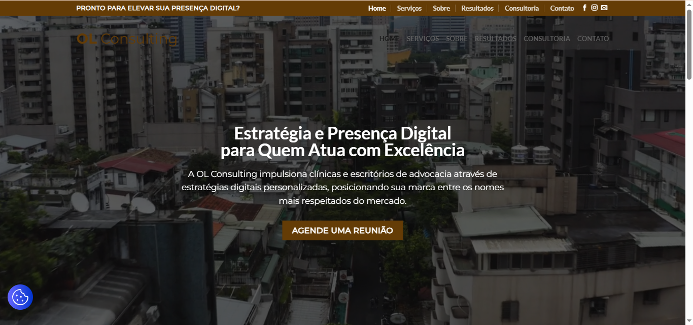

# OL Consulting - Plataforma de Gestão e Agendamento Digital

## 📌 Sobre o Projeto
O **OL Consulting** é uma plataforma digital desenvolvida para modernizar e centralizar os canais de atendimento da **Agência Trampo**, uma empresa de marketing digital e desenvolvimento web.

O objetivo principal foi criar uma divisão clara para as consultorias da agência, entregando um **site institucional** integrado a um **sistema de gestão e agendamento de reuniões**, facilitando o contato entre clientes e consultores.

Este projeto foi realizado como parte da disciplina de **Prática de Gestão de Projetos** na FATEC Rubens Lara.

## 🚀 Funcionalidades

* **Site Institucional Responsivo:** Páginas de apresentação (Home), Sobre, Serviços e Contato com identidade visual corporativa e moderna.
* **Sistema de Agendamento:**
    * Agendamento de reuniões com slots de 45 minutos.
    * Painel administrativo para gestão de horários pela equipe da Agência.
    * Integração direta no ambiente WordPress via plugin customizado.
* **Segurança e Performance:** Implementação de HTTPS e otimização para carregamento rápido.

## 🛠 Tecnologias Utilizadas

O projeto passou por uma decisão estratégica de mudança de tecnologias (leia mais na seção "Desafios") para garantir a entrega e estabilidade. A stack final foi:

* **CMS:** WordPress (Tema Flatsome).
* **Backend/Customização:** PHP (plugin de agendamento) e ajustes.
* **Frontend Customizado:** HTML5 e CSS3 para refinamento de layout e responsividade.
* **Gestão:** Trello (Kanban) para acompanhamento de tarefas.

## 🔄 O "Pivô" Estratégico (Lições Aprendidas)

Um dos maiores diferenciais deste projeto foi a **capacidade de adaptação e gestão de riscos**.

Inicialmente, o projeto foi planejado utilizando **React, Next.js, Node.js e TailwindCSS**. No entanto, durante a execução, identificamos que a complexidade da integração aliada ao prazo curto (8 semanas) estava gerando riscos críticos ao cronograma.

**A Solução:**
Realizamos uma reunião de alinhamento com o cliente e optamos por migrar a arquitetura para **WordPress + PHP**. Essa decisão permitiu:
1.  Garantir a entrega dentro do prazo (18/11/2025).
2.  Reduzir bugs críticos de integração.
3.  Facilitar a manutenção futura por parte do cliente.

## 🚧 Desafios de Infraestrutura

Além do desafio de desenvolvimento, enfrentamos um bloqueio de segurança onde o domínio inicial foi categorizado erroneamente em *blacklists* de firewalls (Fortinet).
* **Resolução:** Atuamos na comunicação com o fornecedor de segurança e realizamos a migração para um novo domínio (`olconsulting.com.br`) para assegurar o acesso dos usuários.

[Acessar OL Consulting](https://olconsulting.com.br/) 
---
*Projeto acadêmico concluído em Novembro de 2025.*
